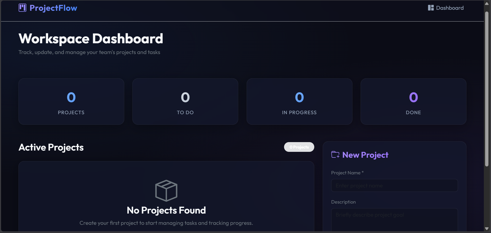
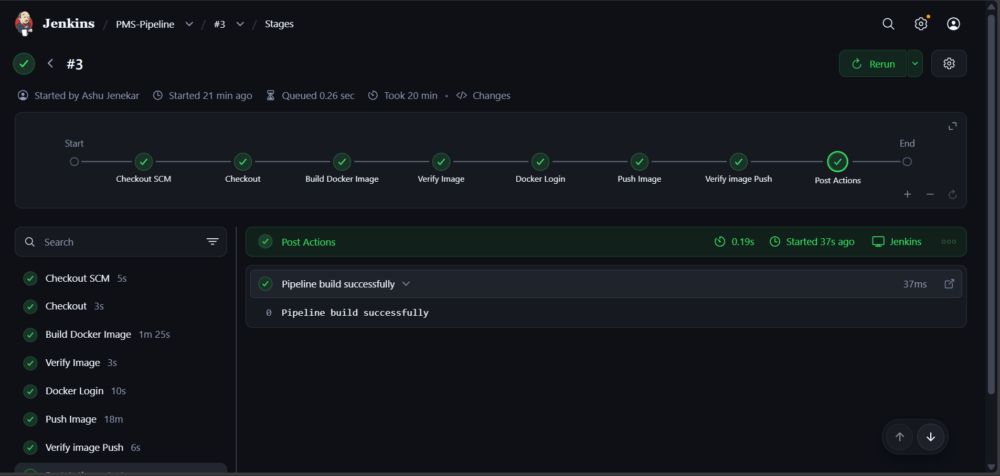
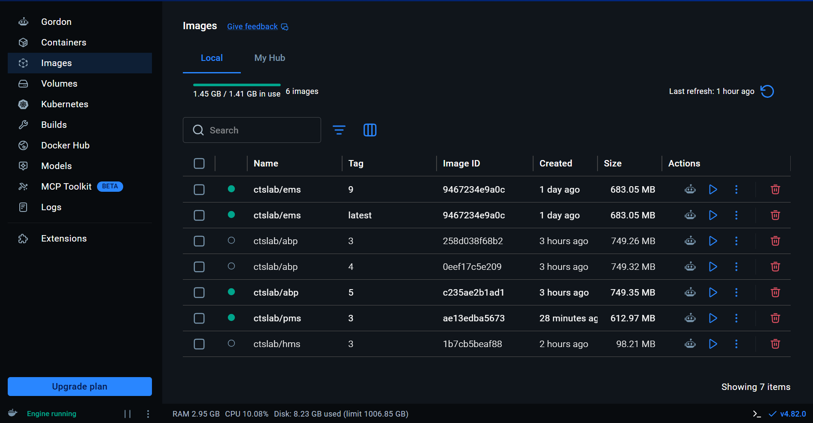
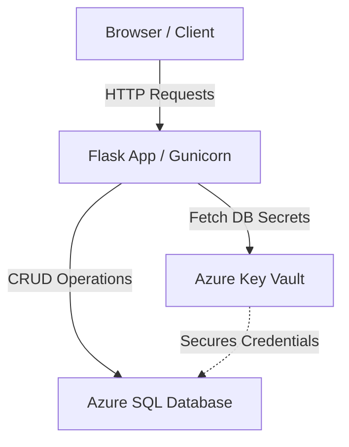
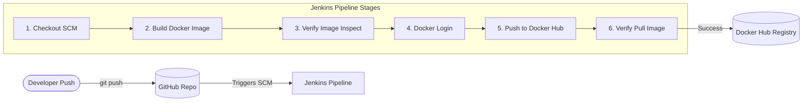

# 🚀 ProjectFlow - Modern Project Management System

ProjectFlow is a modern, web-based **Project Management System (PMS)** built with **Python Flask**, **Azure SQL Database**, and **Azure Key Vault**. It features a glassmorphic dark UI dashboard, Docker containerization, and an automated **Jenkins CI/CD pipeline** for building and publishing Docker images to **Docker Hub**.

---

## 📸 Screenshots

*(Placeholders: Add your application & pipeline screenshots here)*

| Application Dashboard | Jenkins CI/CD Pipeline |
| :---: | :---: |
|  |  |

| DockerHub Image Repository |
| :---: | 
|  |  

---

## 🌟 Key Features

- **Dashboard & Analytics**: Project tracking, task status breakdown, and overall progress stats.
- **Glassmorphic Dark Theme**: UI styled with Bootstrap 5 and custom CSS.
- **Azure Key Vault Security**: Securely retrieves database credentials at runtime (`Server`, `Database`, `Username`, `Password`).
- **Containerized Environment**: `Dockerfile` configured with Debian Bookworm, Python 3.11, Gunicorn, and Microsoft ODBC Driver 18 for SQL Server.
- **Automated CI/CD Pipeline**: Declarative `Jenkinsfile` for automated Docker image building, inspection, authentication, registry pushing, and verification.

---

## 🏗️ Architecture & CI/CD Workflow

### Application Architecture



### Jenkins CI/CD Pipeline Workflow



---

## 🛠️ Tech Stack

| Domain | Technology |
| :--- | :--- |
| **Backend** | Python 3.11, Flask 3.0, Gunicorn 22.0 |
| **Database** | Azure SQL Database, `pyodbc`, Microsoft ODBC Driver 18 |
| **Security** | Azure Key Vault, `azure-identity`, `azure-keyvault-secrets` |
| **Frontend** | HTML5, CSS3, Bootstrap 5, Glassmorphism design |
| **Containerization** | Docker, Docker Engine |
| **CI/CD** | Jenkins (Declarative Pipeline), Docker Hub |

---

## 🔑 Azure Setup Requirements

### 1. Azure SQL Database
1. Provision an **Azure SQL Database**.
2. Enable firewall rules to allow connections from your local machine/container runner.
3. Database tables are automatically created on initial application startup (`init_db()`).

### 2. Azure Key Vault Configuration
Create an **Azure Key Vault** and define the following secrets:

| Secret Name | Description | Example Value |
| :--- | :--- | :--- |
| `Server` | Database server hostname | `your-server-name.database.windows.net` |
| `Database` | Azure SQL Database name | `your-db-name` |
| `Username` | DB admin username | `dbadmin` |
| `Password` | DB admin password | `YourStrongPassword123!` |

Ensure the environment running Flask has Key Vault access permissions (via Azure CLI session, Service Principal, or Managed Identity).

---

## 💻 Local Development Setup

### Prerequisites
- Python 3.11+
- Microsoft ODBC Driver 18 for SQL Server installed on host machine

### Setup Steps
```bash
# 1. Clone the repository
git clone https://github.com/progamerzx/Project-Mangement-System.git
cd Project-Mangement-System

# 2. Create and activate a virtual environment
python -m venv venv
# On Windows PowerShell:
venv\Scripts\activate
# On Linux/macOS:
source venv/bin/activate

# 3. Install dependencies
pip install -r requirements.txt

# 4. Set environment variables (PowerShell)
$env:KEY_VAULT_URI="https://<your-vault-name>.vault.azure.net/"

# 5. Run the application
python app.py
```
Open `http://localhost:5000` in your browser.

---

## 🐳 Building & Running with Docker Locally

Since `pyodbc` requires system-level ODBC drivers, the included `Dockerfile` builds a production-ready image.

```bash
# 1. Build the Docker Image
docker build -t ctslab/pms:latest .

# 2. Run the Container
docker run -d -p 5000:5000 \
  -e KEY_VAULT_URI="https://<your-vault-name>.vault.azure.net/" \
  -e AZURE_CLIENT_ID="<your-azure-client-id>" \
  -e AZURE_CLIENT_SECRET="<your-azure-client-secret>" \
  -e AZURE_TENANT_ID="<your-azure-tenant-id>" \
  -e SECRET_KEY="a-secure-flask-session-key" \
  --name pms-app \
  ctslab/pms:latest
```

Access the app at `http://localhost:5000`.

---

## ⚙️ Jenkins CI/CD Pipeline & Deployment

The project includes a complete **`Jenkinsfile`** to automate building, inspecting, and deploying Docker images to Docker Hub.

### 1. Prerequisites in Jenkins
- **Jenkins Server** running with Docker installed on the build agent.
- **Docker Pipeline Plugin** and **Credentials Binding Plugin** installed in Jenkins.
- Docker Hub Credentials configured in Jenkins:
  - Go to **Manage Jenkins** ➡️ **Credentials** ➡️ **System** ➡️ **Global credentials**.
  - Add credential of type **Username with password**.
  - ID: `dockerhub-creds`
  - Username: Your Docker Hub username (e.g. `ctslab`)
  - Password: Your Docker Hub Access Token or Password.

### 2. Jenkins Pipeline Configuration
1. Create a new **Pipeline** job in Jenkins (e.g., `PMS-Build-And-Deploy`).
2. Under **Pipeline**, set Definition to **Pipeline script from SCM**.
3. Select **Git** and provide repository URL: `https://github.com/progamerzx/Project-Mangement-System.git`.
4. Set Branch Specifier to `*/main`.
5. Script Path: `Jenkinsfile`.
6. Click **Save** and **Build Now**.

### 3. Pipeline Stages Breakdown

```groovy
pipeline {
    agent any
    environment {
        IMAGE_NAME = "ctslab/pms"
        IMAGE_TAG  = "${BUILD_ID}"
    }

    stages {
        stage('Checkout') {
            steps {
                checkout scm
            }
        }

        stage('Build Docker Image') {
            steps {
                bat "docker build -t ${IMAGE_NAME}:${IMAGE_TAG} ."
            }
        }

        stage('Verify Image') {
            steps {
                bat "docker image inspect ${IMAGE_NAME}:${IMAGE_TAG}"
            }
        }

        stage('Docker Login') {
            steps {
                withCredentials([
                    usernamePassword(
                        credentialsId: 'dockerhub-creds',
                        usernameVariable: 'DOCKER_USER',
                        passwordVariable: 'DOCKER_PASS'
                    )
                ]) {
                    bat "docker login -u %DOCKER_USER% -p %DOCKER_PASS%"
                }
            }
        }

        stage('Push Image') {
            steps {
                bat "docker push ${IMAGE_NAME}:${IMAGE_TAG}"
            }
        }

        stage("Verify image Push") {
            steps {
                bat "docker pull ${IMAGE_NAME}:${IMAGE_TAG}"
            }
        }
    }

    post {
        success {
            echo "Pipeline build successfully"
        }
        failure {
            echo "Pipeline failed"
        }
    }
}
```

---

## ⚙️ Environment Variables Reference

| Variable | Description | Required | Default |
| :--- | :--- | :---: | :--- |
| `KEY_VAULT_URI` | Azure Key Vault URI | Yes (or `DB_CONNECTION_STRING`) | None |
| `DB_CONNECTION_STRING` | Direct SQL ODBC Connection String (Local Dev override) | Optional | None |
| `SECRET_KEY` | Flask Session secret key | Yes | `dev-secret-key-change-in-production` |
| `FLASK_APP` | Entry point | Configured in Dockerfile | `app.py` |
| `AZURE_CLIENT_ID` | Service Principal Client ID (for Key Vault auth) | Optional | None |
| `AZURE_CLIENT_SECRET` | Service Principal Secret | Optional | None |
| `AZURE_TENANT_ID` | Service Principal Tenant ID | Optional | None |

---

## 📄 License

This project is open source and available under the [MIT License](LICENSE).
