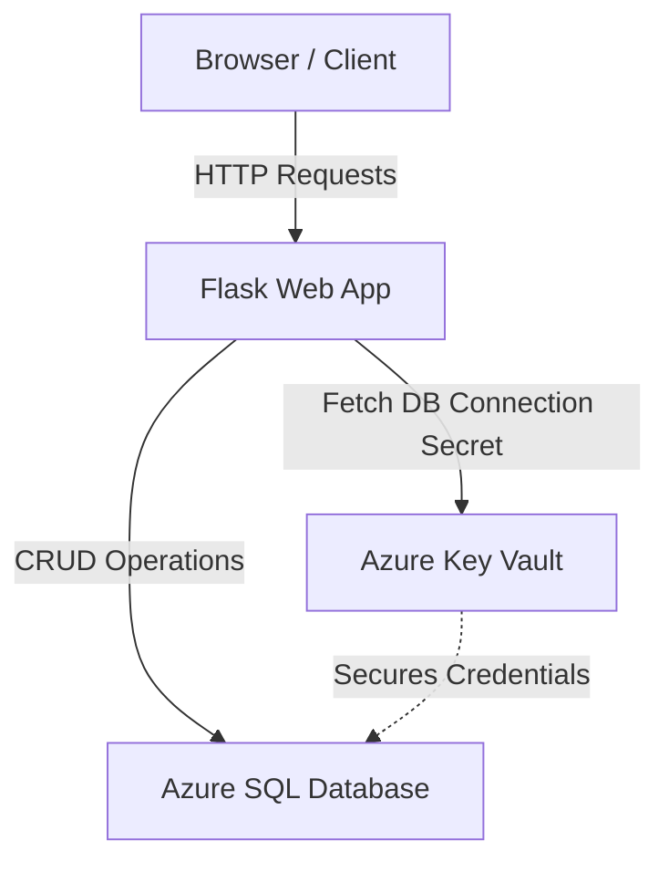

# ProjectFlow - Project Management System

ProjectFlow is a simple, modern Project Management System built with **Python Flask**, using **Azure SQL Database** for persistent storage and **Azure Key Vault** to secure connection credentials.

The interface is styled with a premium glassmorphic dark-theme using Bootstrap 5 and custom CSS.

---

## Architecture Overview



---

## Azure Setup Requirements

### 1. Azure SQL Database
1. Create an Azure SQL Database.
2. Enable connections from Azure services and your local IP address in the database firewall settings.
3. Keep note of the database connection string. It should look like this:
   ```text
   Driver={ODBC Driver 18 for SQL Server};Server=tcp:<your-server-name>.database.windows.net,1433;Database=<your-db-name>;Uid=<your-username>;Pwd=<your-password>;Encrypt=yes;TrustServerCertificate=no;Connection Timeout=30;
   ```

### 2. Azure Key Vault
1. Create an Azure Key Vault.
2. In the Key Vault, add **four individual secrets**:
   - **`Server`**: The DB server address (e.g., `<your-server-name>.database.windows.net`).
   - **`Database`**: The DB name (e.g., `<your-db-name>`).
   - **`Username`**: The database login username.
   - **`Password`**: The database login password.
3. Take note of the Key Vault URI (e.g., `https://<your-vault-name>.vault.azure.net/`).
4. Ensure the identity running the app (your developer account or Azure App Service Managed Identity) has permissions to **Get** secrets from the Key Vault.

---

## Running Locally

### 1. Prerequisites
- Python 3.8+ installed.
- Microsoft ODBC Driver for SQL Server installed on your host machine.
  - Windows: Comes preloaded or download [here](https://learn.microsoft.com/en-us/sql/connect/odbc/download-odbc-driver-for-sql-server).
  - macOS: `brew install microsoft/mssql-release/msodbcsql18`
  - Linux: Set up packages using Microsoft documentation.

### 2. Setup environment variables
Set the following environment variables. In PowerShell:
```powershell
$env:KEY_VAULT_URI="https://<your-vault-name>.vault.azure.net/"
# For local Azure authentication, you can also use Azure CLI:
# Run `az login` to sign in. The DefaultAzureCredential will automatically use your CLI session.
```
*Note: If you want to bypass Key Vault for local development, you can set the database connection string directly:*
```powershell
$env:DB_CONNECTION_STRING="Driver={ODBC Driver 18 for SQL Server};Server=tcp:<server>.database.windows.net... "
```

### 3. Install dependencies & run
```bash
# Create and activate virtual environment
python -m venv venv
venv\Scripts\activate # On macOS/Linux: source venv/bin/activate

# Install dependencies
pip install -r requirements.txt

# Run the application
python app.py
```
Open `http://localhost:5000` in your browser.

---

## Running with Docker

Since `pyodbc` requires system-level ODBC drivers, using the included `Dockerfile` ensures everything is configured correctly in an isolated environment.

### 1. Build the Docker Image
```bash
docker build -t projectflow-app .
```

### 2. Run the Container
You can run the container by passing your Azure credentials and Key Vault configuration as environment variables:

```bash
docker run -d -p 5000:5000 \
  -e KEY_VAULT_URI="https://<your-vault-name>.vault.azure.net/" \
  -e AZURE_CLIENT_ID="<your-azure-client-id>" \
  -e AZURE_CLIENT_SECRET="<your-azure-client-secret>" \
  -e AZURE_TENANT_ID="<your-azure-tenant-id>" \
  -e SECRET_KEY="a-secure-flask-session-key" \
  --name projectflow \
  projectflow-app
```
Now access the application at `http://localhost:5000`.
